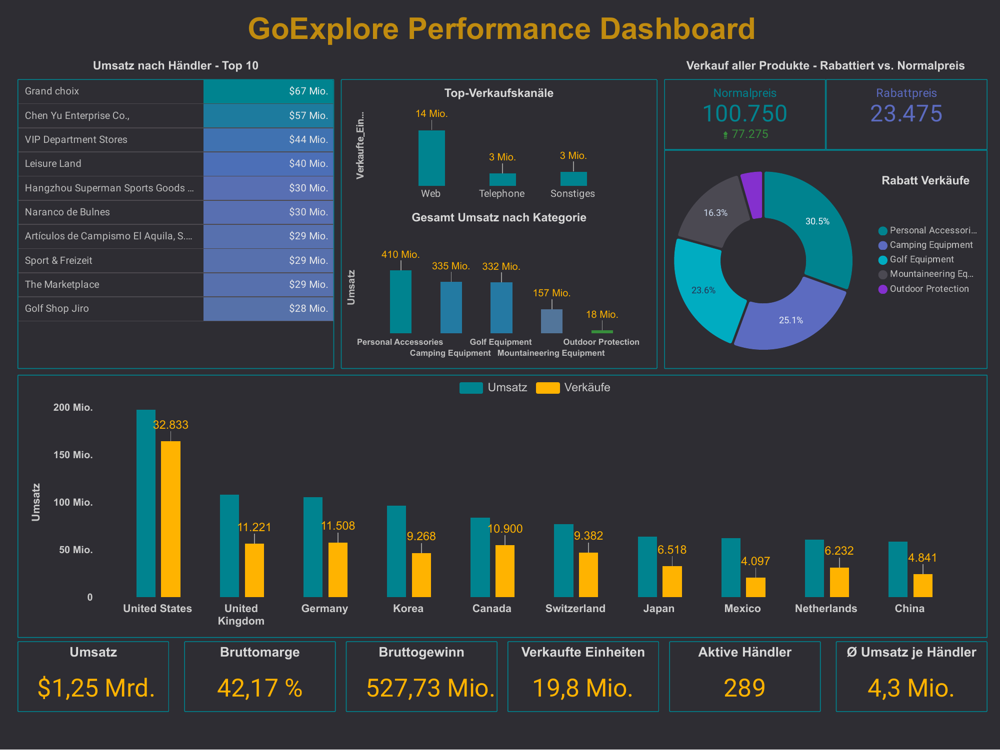
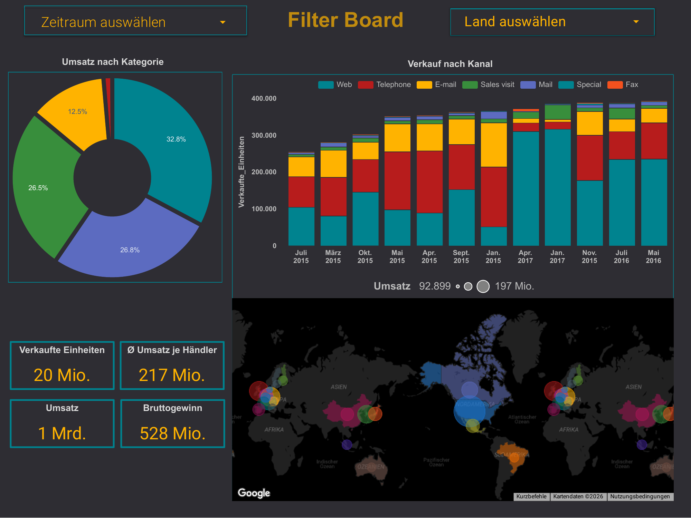
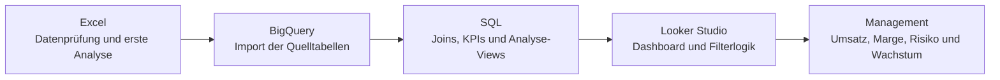

# GoExplore Performance Dashboard


End-to-end BI case study: von der ersten Datenprüfung in Excel über die Modellierung in Google BigQuery bis zum interaktiven Management-Dashboard in Looker Studio.

Der Schwerpunkt dieses Projekts liegt nicht auf einer einzelnen SQL-Abfrage, sondern auf der Übersetzung umfangreicher Verkaufsdaten in einen verständlichen Managementüberblick.



## Ausgangslage

GoExplore erwirtschaftet im betrachteten Datensatz rund **1,25 Mrd. Umsatz**, verkauft **19,8 Mio. Einheiten** und arbeitet mit **289 aktiven Händlern**.

Die Analyse basierte zuvor im Wesentlichen auf Excel und manuellen Auswertungen durch eine einzelne Person. Das erschwert wiederkehrende Analysen, verlängert Reaktionszeiten und erzeugt ein operatives Wissensrisiko.

Das Dashboard bündelt deshalb die wichtigsten Fragen des Tagesgeschäfts:

- Wie entwickeln sich Umsatz, Bruttogewinn und Bruttomarge?
- Welche Händler, Länder und Verkaufskanäle tragen den größten Anteil?
- Wie ausgewogen ist das Produktportfolio?
- Wie stark ist der Umsatz auf einzelne Händler konzentriert?
- Welche Rolle spielen rabattierte Verkäufe für Wachstum und Profitabilität?

## Ergebnis

Das Dashboard besteht aus zwei Ebenen:

1. **Management Overview** - zentrale KPIs, Händlerkonzentration, Produktkategorien, Rabattstruktur, Länder und Verkaufskanäle.
2. **Filter Board** - vertiefende Analyse nach Zeitraum und Land mit zeitlicher Entwicklung und geografischer Verteilung.



Der vollständige statische Export ist unter [`docs/dashboard-report.pdf`](docs/dashboard-report.pdf) abgelegt.

## Zentrale Erkenntnisse

| Kennzahl | Ergebnis | Einordnung |
|---|---:|---|
| Gesamtumsatz | 1,25 Mrd. | Größenordnung des analysierten Geschäfts |
| Bruttogewinn | 527,73 Mio. | Umsatz abzüglich Produktkosten |
| Bruttomarge | 42,17 % | Solide Gesamtprofitabilität im Datensatz |
| Verkaufte Einheiten | 19,8 Mio. | Gesamtmenge im betrachteten Zeitraum |
| Aktive Händler | 289 | Grundlage der Händleranalyse |
| Ø Umsatz je Händler | 4,3 Mio. | Gesamtumsatz geteilt durch aktive Händler |
| Top-10-Händler | 383 Mio. / ca. 31 % | Erkennbare Konzentration, aber kein extremes Klumpenrisiko |
| Größter Händler | 67 Mio. | Rund 5 % des Gesamtumsatzes |
| Personal Accessories | 410 Mio. / ca. 33 % | Umsatzstärkste Produktkategorie |
| Outdoor Protection | 18 Mio. / ca. 1,4 % | Strategische Frage: investieren, neu positionieren oder reduzieren? |
| Rabattierte Verkaufsdatensätze | 23.475 | Ausgangspunkt für eine vertiefte Margenanalyse |

## Analytics Workflow



### 1. Excel

- Tabellenstruktur und Datentypen geprüft
- Schlüsselspalten und Beziehungen identifiziert
- erste Plausibilitätsprüfungen und Vergleichsrechnungen durchgeführt
- Daten für den Import vorbereitet

### 2. BigQuery und SQL

Die Quelldaten wurden in vier fachliche Tabellen aufgeteilt:

- `daily_sales` - Verkaufsdaten und Preise
- `retailers` - Händler und Länder
- `products` - Produktkategorien, Produkttypen und Kosten
- `methods` - Verkaufskanäle

Darauf aufbauend werden Umsatz, Bruttogewinn, Marge, Rabattstatus und Händlerkennzahlen zentral berechnet. Die wichtigste Grundlage ist die View [`sql/01_dashboard_base_view.sql`](sql/01_dashboard_base_view.sql).

### 3. Looker Studio

Die aufbereiteten Abfragen dienen als Datenquellen für:

- KPI-Karten
- Händler-Rankings
- Kategorie- und Kanalvergleiche
- Rabattanalysen
- Länderanalysen
- Datums- und Länderfilter
- geografische Visualisierungen

## KPI-Definitionen

```text
Umsatz = Menge × Verkaufspreis
Bruttogewinn = Menge × (Verkaufspreis - Stückkosten)
Bruttomarge = Bruttogewinn / Umsatz
Ø Umsatz je Händler = Gesamtumsatz / Anzahl aktiver Händler
Rabattiert = Verkaufspreis < regulärer Stückpreis
```

Der durchschnittliche Händlerumsatz wird bewusst **nicht** über `AVG(Quantity * Unit sale price)` berechnet. Diese Berechnung würde den durchschnittlichen Umsatz einer Verkaufszeile liefern, nicht den durchschnittlichen Umsatz pro Händler.

## Repository-Struktur

```text
.
├── assets/
│   ├── dashboard-overview.png
│   └── dashboard-filter-board.png
├── data/
│   └── README.md
├── docs/
│   ├── dashboard-insights.md
│   ├── dashboard-report.pdf
│   ├── data-model.md
│   ├── query-notes.md
│   └── workflow.md
├── sql/
│   ├── 01_dashboard_base_view.sql
│   ├── 02_management_kpis.sql
│   ├── 03_revenue_by_country.sql
│   ├── 04_discount_analysis_web.sql
│   ├── 05_product_line_counts.sql
│   ├── 06_product_type_counts.sql
│   ├── 07_sales_by_channel.sql
│   ├── 08_retailer_concentration.sql
│   └── 09_category_performance.sql
├── .gitignore
├── LICENSE
└── README.md
```

## SQL-Abfragen verwenden

1. Daten in ein BigQuery-Dataset namens `goexplore` importieren.
2. In den SQL-Dateien `your-project-id` durch die eigene Google-Cloud-Projekt-ID ersetzen.
3. Zuerst die Basis-View ausführen.
4. Anschließend die KPI- und Analyseabfragen verwenden oder als Views speichern.
5. Die Views als Datenquellen in Looker Studio anbinden.

Die Rohdaten sind nicht Bestandteil dieses Repositories. Dadurch bleibt das Projekt auf Analyse, Datenmodell und Dashboard fokussiert, ohne fremde Datensätze oder mögliche Lizenzinhalte weiterzuveröffentlichen.

## Fachliche Grenzen

- Ohne eindeutige Bestell-ID entspricht die Anzahl der Verkäufe der Anzahl klassifizierter Verkaufsdatensätze, nicht zwingend der Anzahl vollständiger Bestellungen.
- Der Repository-Export zeigt das Dashboard statisch. Filter und Interaktionen sind nur in der ursprünglichen Looker-Studio-Version verfügbar.
- Rabattzahlen allein beantworten noch nicht, ob Rabatte wirtschaftlich sinnvoll sind. Dafür müssen Umsatz, Menge, Bruttogewinn und Marge gemeinsam betrachtet werden.

## Gezeigte Kompetenzen

- Datenprüfung und Voranalyse in Excel
- Datenmodellierung in BigQuery
- SQL-Joins, Aggregationen, CTEs und Window Functions
- Definition belastbarer KPIs
- Dashboard-Design und Datenvisualisierung
- Übersetzung technischer Analysen in geschäftliche Fragestellungen
- strukturierte Dokumentation eines BI-Projekts
