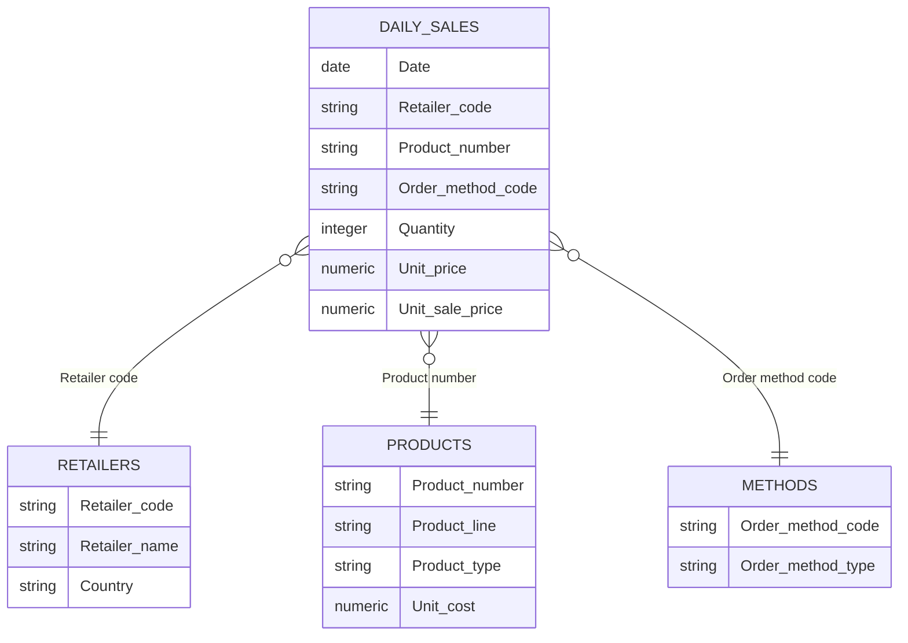

# Datenmodell

Das Projekt verwendet ein einfaches Sternschema. `daily_sales` bildet die Faktentabelle; Händler, Produkte und Verkaufsmethoden liefern die beschreibenden Dimensionen.

## Faktentabelle

### `daily_sales`

Enthält die verkaufsbezogenen Messwerte. Jede Zeile wird als Verkaufsdatensatz behandelt. Da keine eindeutige Bestell-ID vorliegt, darf `COUNT(*)` nicht ohne Einschränkung als Anzahl vollständiger Bestellungen interpretiert werden.

## Dimensionstabellen

### `retailers`

Ergänzt Händlername und Land. Die Tabelle ermöglicht Händler-Rankings, Länderanalysen und die Berechnung aktiver Händler.

### `products`

Ergänzt Produktkategorie, Produkttyp und Stückkosten. Daraus werden Produktmix, Bruttogewinn und Bruttomarge abgeleitet.

### `methods`

Ordnet technische Methodencodes den lesbaren Verkaufskanälen zu.

## Semantische View

`v_dashboard_sales` führt die Tabellen zusammen und berechnet wiederverwendbare Felder:

- `revenue`
- `gross_profit`
- `gross_margin_rate`
- `is_discounted`

Damit verwenden alle Dashboard-Seiten dieselben KPI-Definitionen.
